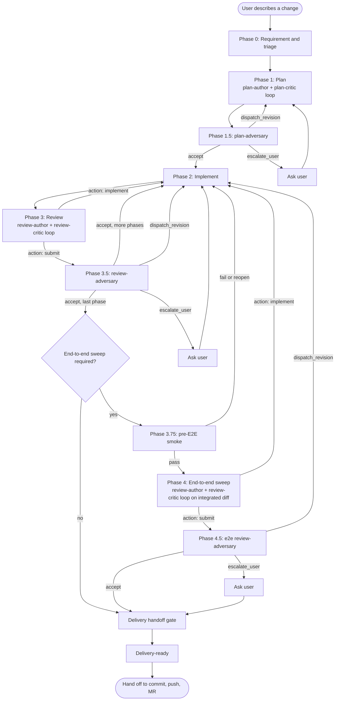
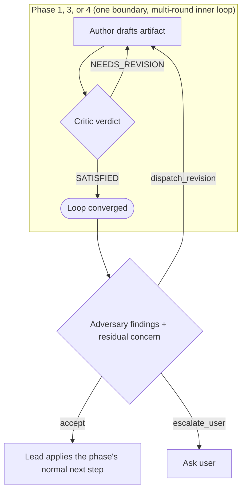
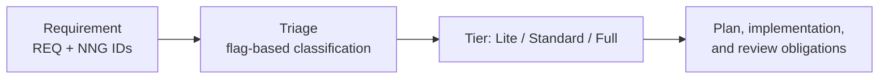
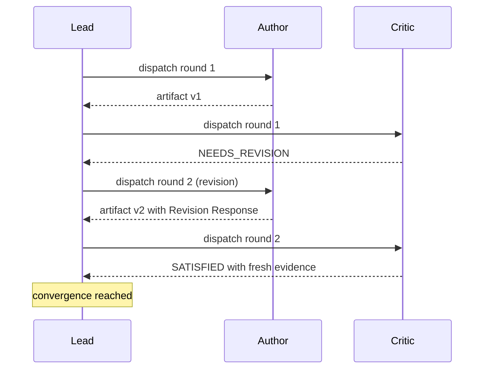
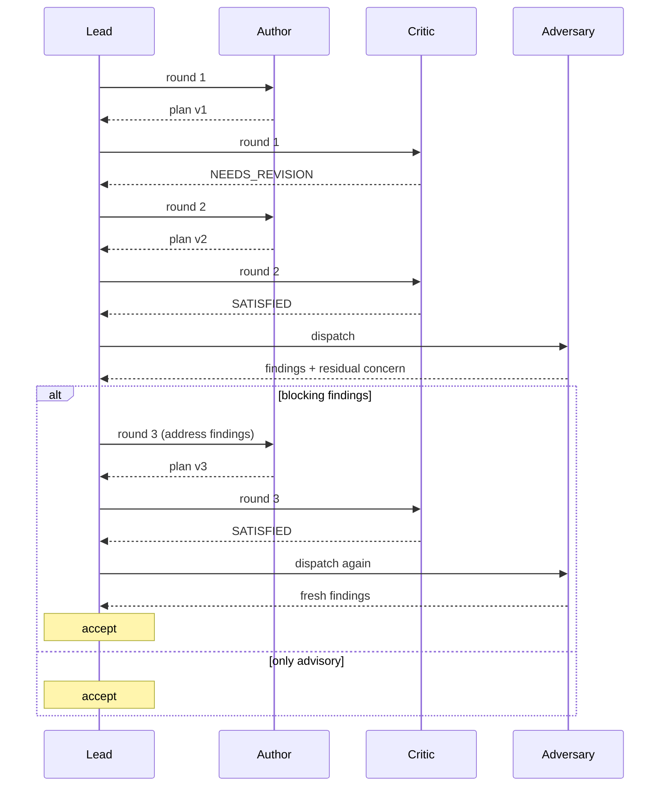
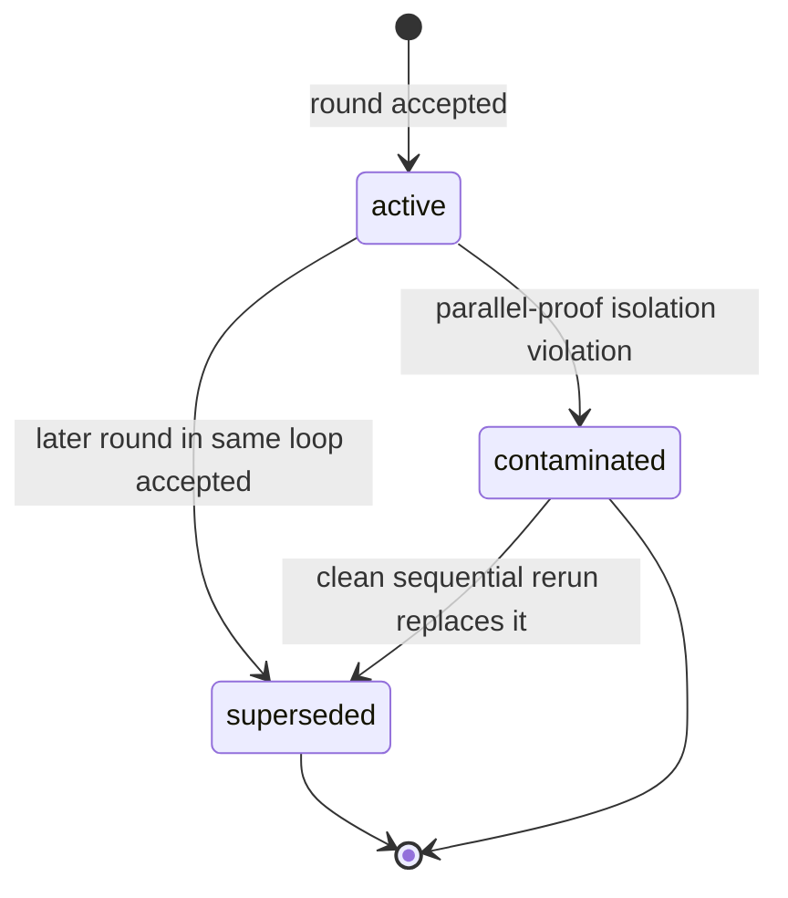

# The Squad Methodology

A protocol for moving a software change from raw requirement to delivery-ready, using a small set of cooperating agents with explicit roles.

## Audience and scope

This document is for an engineer or an agent who has never seen the squad methodology before. By the end of it you should be able to read any squad-* skill in this catalog and understand how it fits.

The protocol is implemented as a family of skills under `skills/squad-*.md`. Those skills are normative; this document is descriptive. When the two disagree, the skills win.

## The problem

Software changes have a lifecycle: someone decides what to build, someone designs how to build it, someone writes the code, someone reviews it, and someone ships it. On a small change a single person does all five jobs in their head. On a non-trivial change those jobs need separating. The reasons are familiar:

- The person closest to the requirement is rarely the best person to question it.
- The person who wrote the design has motivated reasoning to defend it.
- The person who wrote the code does not see the regression they introduced.
- A single reviewer who likes the author tends to approve too quickly.

When a single AI agent runs all five jobs in one conversation, every one of those failure modes still applies, and a few new ones show up too. The agent loses track of which job it is doing. It conflates "the design is internally consistent" with "the design solves the problem." It approves its own code because it understands its own code best. It runs out of context window halfway through review and ships the rest from memory.

The squad methodology splits the lifecycle into phases, assigns each phase to a separate agent invocation, and arranges those invocations into feedback loops that catch errors before they propagate. The protocol is opinionated about who is allowed to do what, what each artifact must contain, and how the system records its own state.

## The core idea: roles, not steps

A naive split assigns each phase one agent: a planner, a coder, a reviewer. That helps but it is not enough. A planner left alone will produce a plausible-looking plan with subtle errors. A reviewer who only looks at the diff will miss structural mistakes that the diff does not show.

The squad methodology layers two ideas on top of phase splitting:

**Author/critic loops.** Inside a phase, two roles iterate. The *author* drafts an artifact; the *critic* reads it and challenges it; the author revises; the critic re-reads. The loop ends when the critic returns `SATISFIED` and certain convergence rules pass. This is the standard adversarial-collaboration pattern, applied at every phase boundary.

**Frame-challenging adversaries.** After the author and critic agree, a third role steps in: the *adversary*. The adversary's job is not to validate the artifact against the requirement and the plan; that is what the critic does. The adversary's job is to challenge the requirement and the plan themselves. We will see why this matters in a later section.

**A single orchestrator.** A *lead* dispatches the specialists, reads their outputs, and decides what happens next. The lead does not write plans, code, or reviews; it routes. This separation matters: it means no specialist has to manage state, and the lead has full visibility into the lifecycle.

Three classes of specialist role, then, plus a single orchestrator: authors who draft, critics who validate, adversaries who challenge frames, and a lead that routes. This document introduces them in the order they fire on a real task.

## The lifecycle at a glance

Before we name any roles, here is the shape of a typical run:

Phases 0 through 4 are the requirement-through-sweep arc. Phases 1.5, 3.5, and 4.5 are the adversary checks. Phase 3.75 is a cheap pre-E2E smoke that runs after all phases are locally accepted and before the integrated end-to-end sweep, when a sweep is required. The delivery handoff gate runs after the final review converges; only after it passes does the lead set `delivery-ready`. Each plan and review phase is itself a multi-round author/critic loop; the adversary runs *after* that loop converges, not in place of it. The next diagram zooms into one phase to make this explicit.

The critic gates the loop. The adversary does not gate; it produces information the lead reconciles. Both roles run on every plan boundary and every review-with-action-submit boundary. We will see them in detail in the phase sections below.

## Phase 0: Requirement and triage

A run starts when the user describes a change. The first job is to convert that description into two artifacts: a *requirement* and a *triage*.

### The requirement

A requirement names the problem the change must solve. It uses two kinds of identifier that recur throughout the lifecycle:

- `REQ-XXX` rows describe what the change must achieve.
- `NNG-XX` rows describe non-negotiables: properties the change must not violate.

Each row has a falsifiable signal. "The CLI must be backward compatible" is not falsifiable; "the CLI must accept every argument set valid in version 1.4" is. Falsifiability matters because every later phase verifies behavior against these IDs.

### The triage

Once the requirement is stable, the lead produces `triage.md`. Triage is a flag-based classification of the proposed change. The flags answer questions like:

- Does this change a contract that more than one caller depends on?
- Does this change persisted state?
- Does this move the source of truth between components?
- Does this affect security, safety, compliance, or performance behavior?

Each flag is `true`, `false`, or `unknown`. Flag values drive everything downstream: which plan sections are mandatory, whether an end-to-end sweep is required, what kind of evidence the review must produce. Triage starts as `proposed`. The plan-critic validates it during Phase 1 round 1 (Angle 0); on a passing verdict the lead transitions the status to `validated`. Triage has no dedicated critic of its own; this inline validation is the only check.

A computed *tier* (Lite / Standard / Full) summarizes the flag state. Tier drives how strict the protocol is. Tier Lite skips the heavy sections; Tier Full runs every gate.

We will see flags reappear in every later phase. The lifecycle is structured so that triage answers, once correct, mechanize obligations all the way to delivery.

## The author/critic loop

Phase 1 is the first place we use the author/critic pattern, so we introduce the pattern here before we describe Phase 1 itself.

Every author/critic loop has the same shape:

1. The *author* drafts an artifact at a known file path.
2. The *critic* reads the artifact and produces a verdict: `SATISFIED` or `NEEDS_REVISION`. A `NEEDS_REVISION` verdict carries a blocking-reason string and a list of issues classified by severity.
3. If the verdict is `NEEDS_REVISION`, the author revises. The revised artifact must contain a `## Revision Response` section explaining how each blocking issue was addressed, dismissed, or deferred.
4. The critic reads the revision and produces a new verdict.
5. The loop repeats until the critic returns `SATISFIED` and certain convergence rules pass.

Two rules keep the loop honest:

- The critic must do a *fresh pass* on every round when the artifact's design surface changed. It cannot anchor on prior findings; if the author rewrote half the artifact, the critic has to re-read the whole thing.
- A `SATISFIED` verdict must include either evidence of fresh investigation or an explicit `## Strongest Remaining Objection`. An empty `SATISFIED` verdict (no findings, no evidence, no objection) is treated as `NEEDS_REVISION` by the lead.

Both rules push back against the natural tendency of long loops to drift toward "looks fine." Without them, an author and critic locked in revision can converge by attrition rather than agreement.

Each loop has a maximum number of rounds (typically six for plan loops, ten for the implementation-and-review cycle per phase). If the loop hits the cap, the lead records a final artifact and decides whether to stop, escalate to the user, or proceed with explicit assumptions documented in `## Open Questions` or `## Unresolved Disagreements`.

We use this pattern in three places: Phase 1 (plan), Phase 3 (per-phase review), and Phase 4 (end-to-end sweep). Each instance has its own author and critic skill, but the shape is identical.

## Phase 1: Plan

Phase 1 produces a *plan*: a self-contained document that an implementer can execute without chat history. The plan must include:

- A requirement ledger that lists every `REQ-XXX` and `NNG-XX` from the requirement, with a verification method per row.
- A `## Design` section explaining the technical approach.
- Conditional sections triggered by the triage flags (a producer/consumer audit when shared contracts change, a persistence and authority model when persisted state changes, scenarios when the work needs behavior traceability, and so on).
- A `## Verification Inputs` table giving the implementer and reviewer the exact commands, fixtures, and expected signals for each proof path.

Phase 1 runs an author/critic loop:

- `squad-plan-author` drafts the plan.
- `squad-plan-critic` validates it against the requirement, the triage, and the codebase.

The critic does six audit passes (shared contracts, persistence, data structures, phase integrity, contradiction sweep, evidence pass) plus a sweep over named angles (structural completeness, scope and feasibility, verification depth, semantic coherence, NNG verification, walkthrough simulation). Round one always includes Angle 0: triage validation. If Angle 0 fails the round is rejected and triage must be re-run.

When the critic returns `SATISFIED` and convergence rules pass, the lead does not yet record the plan as accepted. There is one more step.

## Phase 1.5: The plan adversary

Here is a concrete failure that motivated this part of the protocol.

A real task ran the plan loop three times. Each round produced a plan; each round, the critic returned `SATISFIED`. The third round's critic was thorough: it read crate source code, verified specific constants in the codebase, and walked through the cancellation chain in the runtime. By every standard the inner loop had converged.

An external reviewer then read the same converged plan and found five blocking gaps:

1. The plan assumed all skills lived at `<slug>/SKILL.md`, but the codebase also supported a flat `<slug>.md` variant. The plan had no behavior for the flat variant and would have shipped broken on day one.
2. The plan claimed a 90-second outer timeout, but no `## Verification Inputs` row would actually prove it. The claim existed only in pseudocode comments.
3. The plan referenced `tokio_util::sync::CancellationToken`, but `tokio-util` was not in the workspace. The build would have failed.
4. The plan's content sanitization logic appeared at two boundaries with separately written code. There was no shared helper, so future drift between the two implementations was inevitable.
5. The plan punted a structural choice (rewrite the service vs. keep IPC scoping) that the implementer would hit immediately.

These were not nitpicks. Three rounds of plan-author-and-critic, on a task where the critic was diligent enough to verify constants in source, missed every one.

The reason is structural. The plan-critic reads the plan, the requirement, and the triage. The plan-author wrote the plan and read the same requirement and triage. Both work *inside the same frame*. Frame-level mistakes are invisible from inside the frame. "Does the plan handle every variant of the input artifact the codebase already supports?" is a question that does not appear on the critic's checklist, because the checklist is built by the same kind of reasoning that produced the plan.

The plan adversary is the role that runs *after* the inner loop converges, with one job: challenge the frame.

### What the adversary does

The adversary reads the converged plan, the requirement, the triage, and the codebase, and produces an artifact with five sections:

- `## Evidence Surface` lists what it actually read: files, library sources, runtime semantics verified, workspace dep checks, depth declined.
- `## Findings` classifies issues into `Blocking`, `Advisory`, and `Strategic` buckets.
- `## Strongest Residual Concern` names the highest-confidence-in-existence risk surfaced by the depth, even when no blocker emerged.
- `## Frame Challenges` records assumptions in the requirement, the triage, or the plan that, if revised, would reshape the work.
- `## Deviations` records depth that was blocked or declined.

The adversary does not return `SATISFIED`. It does not gate routing. It produces information; the lead reconciles.

### Why the adversary is informational, not gating

Two reasons. First, gating creates convergence pressure: the gating role wants to converge because converging is its success state. The plan adversary's whole job is to escape that pressure. Making it gating would re-create the trap.

Second, every adversary run produces *some* output (the residual-concern rule guarantees it). If every adversary run gated, every plan would dispatch a revision round at least once, even on plans that were already correct. The information-only contract lets the lead distinguish "this plan needs more work" from "this plan is fine and here is the highest-confidence risk to keep an eye on during implementation."

### How the lead reconciles

The lead reads the adversary artifact and picks one decision:

- `accept` when no `Blocking` and no `Strategic` findings remain and the residual concern is bounded. Advisory findings are allowed. Record the plan acceptance and advance to Phase 2.
- `dispatch_revision` when blocking findings exist. Bump the plan round, re-enter Phase 1, the author addresses each blocking finding in `## Revision Response`, and the critic loop runs again to `SATISFIED`. The adversary then runs again at the next convergence with a fresh artifact path.
- `escalate_user` when strategic findings or frame challenges require a product or architecture decision the lead cannot make alone.

The user is only involved on `escalate_user`. Both `accept` and `dispatch_revision` are made by the lead alone: the routine case where the adversary surfaces a blocker is a revision round, not a user page. The user enters the loop only when the decision is genuinely outside the lead's authority (a product or architecture call, an out-of-scope frame challenge, or, in review-adversary mode, a finding that attributes blame to the plan or an earlier phase). The same rule holds for the review-adversary in Phase 3.5 and Phase 4.5.

The adversary fires once per *convergence*, not once per round. If the lead dispatches a revision and the inner loop reaches `SATISFIED` again, the adversary fires a second time. This is not the same as running the adversary on every author/critic round; that would re-introduce convergence pressure into the inner loop.

Tier Lite plans may skip the adversary at lead discretion; the skip is recorded as a drift-check entry. Tier Standard and Tier Full plans always run the adversary at convergence.

## Phase 2: Implement

Once the plan is accepted, an implementer takes one *phase* of the plan and produces an implementation report plus the actual code changes. A phase is a stable unit of the plan with a fixed ID like `PHASE-01`, `PHASE-02`. Plans without phases run as a single `PHASE-ALL`.

Implementation does not run an author/critic loop. The implementer is one role; its output is reviewed in Phase 3 by a separate review-author and review-critic, so the cross-check still happens, just not inside Phase 2. (Phase 0 also has no internal loop: triage is single-author and validated inline by the plan-critic's Angle 0 in Phase 1 round 1.) If the implementer discovers a producer, consumer, persistence surface, or boundary that the triage missed, it stops and reports a boundary-flag discovery, which forces a re-triage.

## Phase 3: Review

Phase 3 reviews the implementation of one phase. It runs the same author/critic pattern as Phase 1:

- `squad-review-author` produces a review report against the actual diff.
- `squad-review-critic` validates the review.

The review's primary output is an `action` field: `submit` (this phase is done) or `implement` (loop back to Phase 2 for another implementation round).

When the review converges with `action: implement`, the lead loops back to Phase 2 directly. There is no adversary in that case; the implementation is going to be rewritten anyway.

When the review converges with `action: submit`, the lead transitions to Phase 3.5 before advancing.

## Phase 3.5: Per-phase review adversary

The same structural argument that motivated the plan adversary applies at the review boundary. The review-author and review-critic share a frame: the diff, the plan, the triage, the implementation report. Frame-level mistakes (regressions outside the named scenarios, implementation claims about external systems that the review accepted at face value, missing workspace deps that the local build masked) are invisible from inside the frame.

`squad-review-adversary` runs once per converged review with `action: submit`. Its contract mirrors the plan adversary:

- Depth declaration is the primary deliverable.
- Findings are classified `Blocking` / `Advisory` / `Strategic`.
- A `## Strongest Residual Concern` is required even when no blocker is surfaced.
- The adversary never returns `SATISFIED`.

The lead's reconciliation is the same three decisions: `accept`, `dispatch_revision`, `escalate_user`. On `accept` the lead applies the original Phase 3 branch (advance to next phase, advance to Phase 4 if required, or mark delivery-ready). On `dispatch_revision` the lead loops back to Phase 2 for the same phase. On `escalate_user` the lead asks the user, particularly when blocking findings attribute blame outside this phase (to the plan or to an earlier phase) which the lead does not unilaterally reopen.

The adversary does not run when the review's `action` is `implement`. The lead is already routing back; the implementation will rewrite the surface the adversary would have audited.

## Phase 3.75: Pre-E2E integration smoke

When the triage requires Phase 4, the lead does not jump straight from the last phase's local submit into the integrated end-to-end sweep. Phase 4 is expensive: it dispatches a full review-author/critic loop against the entire change. Cheap, mechanical drift between phases should be caught before that.

Phase 3.75 is that cheap preflight. After every required implementation phase is locally accepted (Phase 3.5 done) and before any Phase 4 dispatch, the lead runs a smoke artifact that checks:

- Every NNG and high-risk REQ claim row whose `proof_stage` is `cross_phase_smoke` is satisfied against the composed tree.
- Every fixture added by the lifecycle has an accepted consuming test or exercise.
- Every removed surface has an accepted negative scan over the composed tree, not just one phase's slice.
- Every public command named in docs or UI help has an accepted help or existence proof.
- Lifecycle artifacts (manifest, final review records, handoff/status docs, changelog state) do not visibly contradict each other.

The smoke is mechanical. The lead reads accepted artifacts, runs literal scans named in the plan, and runs help commands. If a smoke question requires interpreting implementation source, that work belongs to the Phase 4 review-author, not here. If the smoke finds a defect attributable to one phase, that phase's `closure.local_status` transitions to `reopened_by_pre_e2e_smoke` and the lead loops back to Phase 2 for that phase. If the smoke finds a plan or framing problem, the lead escalates to the user before any Phase 4 dispatch.

Tier Lite tasks may skip the smoke with a `drift_checks` entry naming why the full Phase 4 sweep or direct delivery gate is sufficient. Tier Standard and Tier Full always run it when Phase 4 is required.

## Phase 4: End-to-end sweep

Per-phase reviews see one phase's diff. They cannot see *cross-phase* regressions: a contract established in Phase 1 silently violated in Phase 3, an acceptance criterion no longer satisfied once the phases compose, a behavior change that emerged only in the integrated result.

Phase 4 catches those. It runs when the triage flags require it: any Risk flag is `true`, or `multi-phase: true` is combined with one of `shared-contract-change`, `persisted-state-change`, `authority-shift`, `external-behavior-change`, or `compatibility-promise`. (`multi-phase: true` alone does not trigger Phase 4.) The sweep is a review against the integrated diff and the original requirement. It runs the same author/critic pattern as Phase 3, with one difference: the review reads every primary acceptance criterion against the full integrated change, not against any single phase's plan.

When the sweep converges with `action: implement`, the lead applies the existing reopen-by-end-to-end mechanism: the sweep names the phase that introduced the regression, that phase's `closure.local_status` transitions to `reopened_by_e2e`, and the lead loops back to Phase 2 for that phase.

When the sweep converges with `action: submit`, the lead transitions to Phase 4.5 before entering the delivery handoff gate.

## Phase 4.5: End-to-end review adversary

`squad-review-adversary` runs again, this time in `mode: end_to_end`. The frame here is "the integrated diff against the requirement," and the adversary challenges *that* frame. The reconciliation surface is the same three decisions; on `dispatch_revision` the lead uses the existing reopen-by-end-to-end mechanism for the targeted phase.

After Phase 4.5 accepts, the lead enters the delivery handoff gate before marking the lifecycle `delivery-ready`.

## Delivery handoff gate

Acceptance of the final review (Phase 3.5 or Phase 4.5) is necessary but not sufficient for delivery. Before the lead may set `current.phase: delivery-ready`, a separate handoff gate runs. It verifies:

- the manifest is valid against every applicable validation rule
- the current triage round is `validated` and does not require revalidation
- every waiver that lifts a delivery gate is user-ratified, unexpired, and scoped to its proof obligation
- every carry-forward deferred item is resolved; promoted or escalated defers name a concrete target
- every `proof_stage: delivery` NNG or high-risk REQ claim has a satisfied `delivery_claims` entry with concrete evidence and `execution_mode` for command-backed proof
- the final review round's adversary block records `lead_decision: accept` (or `escalate_user` paired with a ratified user waiver, or `skipped` paired with a Tier Lite drift check)
- a lifecycle coherence audit confirms manifest, final review records, handoff or status docs, and changelog state agree

Only after every gate passes does the lead set `current.phase: delivery-ready` and hand off to delivery for changelog authoring, commit, push, and MR creation.

## The lead

The lead is the only role that writes the manifest, dispatches specialists, and decides what happens next. Specialists do not dispatch other specialists; they produce artifacts and report.

The lead does not perform any of the specialist work itself. It does not write plans, code, or reviews. Its job is routing, state management, and reconciliation. This separation has two benefits:

- Specialists run in clean contexts. They are not contaminated by prior conversation history or by other specialists' frames.
- The lead has full visibility into every artifact produced, which means resume after interruption is mechanical: read the manifest, re-validate, continue from the recorded position.

The lead also runs *child-session discipline*: when a specialist is slow, the lead waits with bounded heartbeat checks instead of escalating immediately. The reference for that lives in `skills/squad-lead/references/squad-lead-child-session-discipline.md`.

## The manifest

Every state-transition decision the lead makes lives in `manifest.yaml`. The manifest is strict YAML with no anchors, no aliases, no implicit dates. Unknown keys reject the document; missing required keys reject the document.

The manifest tracks:

- The requirement path, revision, and freeze timestamp.
- The triage path and every triage round.
- The plan rounds, with each round's path, acceptance status, routing-authority status, and adversary block.
- The phases, each with its implementation rounds, review rounds, and closure status.
- The end-to-end sweep rounds (when the sweep is required).
- Waivers (lifted gates with explicit user or migration approval).
- Amendments (mid-flight requirement or scope changes).
- Drift checks (audit trail of routing decisions and contract drift).
- The current state: which phase, which loop, which round, what is awaited.

The manifest is *append-only-forward*. No field is deleted. A round that was once authoritative becomes `superseded` (a later round in the same loop replaced it) or `contaminated` (its evidence was never trustworthy because of an isolation violation). The artifact file stays on disk as historical record; only routing authority changes.

The manifest has a long list of validation rules (rules 1 through 19, plus several lettered subrules). Some are mechanical (every `path` field points to an existing file). Some encode protocol semantics (a plan round whose adversary `lead_decision` is `dispatch_revision` is not eligible to be `plan.final_round`). The lead applies these rules before every phase transition and on every resume.

## A worked example

Let us walk a small task through the protocol with concrete artifacts. Imagine the task is "add a CLI flag to opt out of the new caching behavior."

1. **Phase 0.** The user describes the change. The lead normalizes it into a requirement with `REQ-001` ("the CLI accepts `--no-cache`") and `NNG-01` ("existing CLI invocations without the flag behave identically to before"). The lead produces `triage.md` flagging `external-behavior-change: true`, `compatibility-promise: true`, all other flags `false`. Tier: Standard.

2. **Phase 1, round 1.** The plan-author produces a plan with a requirement ledger, a design that adds the flag to the argument parser and threads it to the cache layer, an end-state walkthrough showing one CLI invocation flowing through to the disabled cache, and verification inputs (the exact CLI command, the expected stdout, the cache directory check). The plan-critic finds a missing producer/consumer audit (the cache layer has more than one caller) and returns `NEEDS_REVISION`.

3. **Phase 1, round 2.** The author adds the audit. The critic returns `SATISFIED` with fresh evidence: it grepped the cache layer's callers and confirmed all three are migrated.

4. **Phase 1.5.** The lead dispatches the plan adversary. The adversary reads the codebase, confirms the cache layer's callers, and notices that the existing CLI argument parser uses a `clap` derive macro. The plan describes the flag in prose but does not show the `#[arg]` attribute. The adversary classifies this as `Advisory`: the implementer will figure it out from the existing pattern, but the plan is incomplete. The adversary's `Strongest Residual Concern` flags that the cache layer's third caller (an integration test) might not actually exercise the new flag path. The lead picks `accept` and records the adversary block in the manifest.

5. **Phase 2.** The implementer adds the flag, threads it through, runs the test suite, and produces an implementation report.

6. **Phase 3, round 1.** The review-author produces a review with `## Feature Exercise Evidence` (it ran the new flag and observed the cache directory was not written), `## Regression Evidence` (it ran a prior invocation without the flag and observed identical output), and recommends `submit`. The review-critic returns `SATISFIED`.

7. **Phase 3.5.** The review adversary reads the diff. It finds that the new flag correctly skips the cache write, but the cache *read* still happens before the flag is checked. So a stale entry from a prior cached run will still be returned. This is a `Blocking` finding: the flag is supposed to disable caching, not just disable cache writes. The lead picks `dispatch_revision` and loops back to Phase 2.

8. **Phase 2 round 2.** The implementer fixes the read path.

9. **Phase 3 round 2.** The review-author and review-critic re-converge. The action is `submit`.

10. **Phase 3.5 again.** The adversary runs a fresh check. Both read and write paths now correctly honor the flag. No blocking findings; the residual concern names "if a future code path adds another cache touch, the flag check might be missed." The lead picks `accept`. This was a single-phase task, so the lead skips Phase 4 and marks the lifecycle `delivery-ready`.

11. **Delivery handoff.** The lead verifies the manifest is valid, every waiver is ratified, every defer is acknowledged, and hands off to the changelog author, commit, push, and MR.

That walkthrough shows every role at least once and shows where the adversaries earned their cost (one blocking find at the review boundary that the in-loop critic missed).

## Vocabulary cheat sheet

For reference. Each term is introduced and used above; this is a recap.

- **Lead.** The orchestrator. Routes, dispatches, writes the manifest, reconciles adversary findings. Makes `accept` and `dispatch_revision` decisions alone; only escalates to the user when a decision is outside its authority.
- **Author.** The role that drafts an artifact (plan-author, review-author, implementer).
- **Critic.** The role that validates an artifact against its frame (plan-critic, review-critic).
- **Adversary.** The role that challenges the frame after convergence (plan-adversary, review-adversary). Produces findings; does not decide routing.
- **User.** The human who owns the change. Describes the requirement, ratifies waivers, decides on `escalate_user` paths and max-rounds escalations. Not paged for routine revision rounds.
- **Convergence.** The state when an author/critic loop has reached `SATISFIED` with the convergence rules satisfied (fresh pass when needed, evidence on `SATISFIED`, no new blocking issue).
- **Round.** A numbered iteration inside a phase. In plan and review phases, one round is one author turn plus one critic turn. In implementation phases, one round is one implementer dispatch (no inner critic). The manifest tracks rounds per loop.
- **Phase.** A stable unit of the plan with a fixed ID (`PHASE-01`, `PHASE-02`, `PHASE-ALL`).
- **Triage.** The flag-based classification of the change. Drives obligations downstream.
- **Tier.** The Lite / Standard / Full label computed from triage flags. Drives strictness.
- **Manifest.** `manifest.yaml`, the structured state machine for the lifecycle.
- **Waiver.** A recorded lift of a specific gate, scoped to a specific round, granted by `user`, `lead`, or `migration`.
- **Drift check.** An append-only audit-trail entry recording a routing decision, a re-triage, or a contract drift.
- **Closure.** A phase's local-acceptance state: `open`, `locally_accepted`, or `reopened_by_e2e`.
- **Routing authority.** Whether a round is currently usable for routing. Values: `active`, `superseded`, `contaminated`.

## What the protocol is not

A few common confusions, addressed directly.

The protocol is not a *waterfall*. The phases are sequenced, but feedback loops thread back through them at every boundary. A plan round can reopen triage. An implementation round can force a re-plan. An end-to-end sweep can reopen any phase. The lead routes back as evidence demands.

The protocol is not a *bureaucracy*. Tier Lite skips most of the heavy machinery: a small plan, a single phase, a focused review, with the adversaries optional. The structure is designed so that small changes pay small costs.

The protocol is not a *replacement for engineering capability*. The agents still need to be capable of reading code, writing tests, designing data structures, and reasoning about runtime semantics. The protocol catches the failure modes that emerge when capable agents work alone or in same-frame pairs. It does not turn an incapable agent into a capable one. (The word "skill" is reserved in this catalog for the named files under `skills/`, so it is not used here in the human-capability sense.)

The protocol is not *fixed*. The skill files in this catalog are the current implementation. As empirical experience accumulates (which findings the adversaries actually catch, which gates produce friction without value, where the boundaries between roles are wrong), the skills evolve. The history of those changes lives in `docs/changelog/` and `docs/design/`.

## Where to read next

To go deeper, the natural reading order is:

1. `skills/squad-lead/SKILL.md` for the orchestrator's full responsibilities.
2. `skills/squad-triage/SKILL.md` for the triage flag definitions and `skills/squad-manifest/SKILL.md` for the state machine.
3. `skills/squad-plan-author/SKILL.md`, `skills/squad-plan-critic/SKILL.md`, `skills/squad-plan-adversary/SKILL.md` for the plan loop.
4. `skills/squad-implementer/SKILL.md` for the implementation contract.
5. `skills/squad-review-author/SKILL.md`, `skills/squad-review-critic/SKILL.md`, `skills/squad-review-adversary/SKILL.md` for the review loop.
6. `skills/squad-convergence/SKILL.md` for the loop rules that all author/critic pairs share.
7. `skills/squad-plan-verification/SKILL.md`, `skills/squad-implementation-verification/SKILL.md`, `skills/squad-review-verification/SKILL.md` for the artifact schemas.
8. `skills/lifecycle-coherence-audit/SKILL.md` for the delivery-readiness coherence rules.

The skill files are normative and exhaustive; this document is the map.
